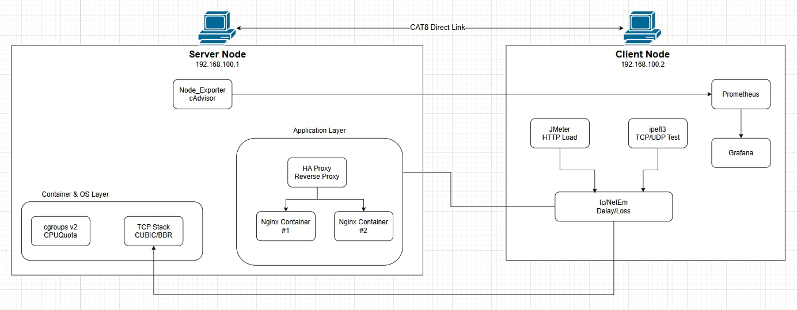
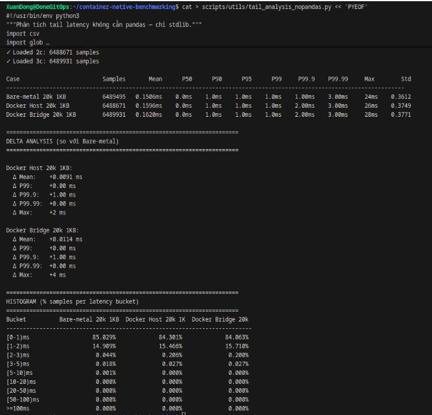

# 🚀 Container-Native Benchmarking Lab

<p align="center">
  
  
  
  
</p>

Đồ án: **Đánh giá Hiệu năng Mạng và Chi phí Ảo hóa trong Kiến trúc Container-Native: So sánh TCP Congestion Control, Docker Network Stack và Reverse Proxy dưới điều kiện mạng suy giảm và CPU Throttling.**

## 👥 Nhóm Thực Hiện (Nhóm 9)
* **Hoàng Xuân Đồng** (MSSV: 23520297) - *Server Setup & System Monitoring*
* **Trần Hải Đăng** (MSSV: 23520237) - *Client Load Generation & Network Emulation*
* **Giảng viên hướng dẫn:** Đặng Lê Bảo Chương

---

## 📖 Giới thiệu (Introduction)
Dự án này xây dựng một phòng thí nghiệm đo lường hiệu năng (Benchmarking Lab) trên môi trường Bare-metal thực tế. Mục tiêu cốt lõi là định lượng chính xác độ trễ (đặc biệt là Tail Latency - P99) và "chi phí tàng hình" (Overhead) của từng lớp trừu tượng trong hệ thống mạng hiện đại (Docker Network, Reverse Proxy, CPU Throttling bằng cgroups v2, TCP Congestion Control).

Dự án áp dụng chặt chẽ **Lý thuyết Hàng đợi (Queueing Theory)** và **Định luật Little (L = λ × W)** để giải mã các hiện tượng "bùng nổ độ trễ" (Latency Explosion) và thắt cổ chai (Bottleneck) trong các hệ thống phân tán.

<p align="center"></p>

## 💻 Yêu cầu Hệ thống (Prerequisites)
Để đảm bảo tính chính xác tuyệt đối trong việc đo lường độ trễ ở mức Microsecond (µs), lab yêu cầu cấu hình khắt khe:
* **OS:** Ubuntu 24.04 LTS (Chạy trên Bare-metal, tuyệt đối không dùng máy ảo VM để tránh ảo hóa lồng ghép gây sai lệch chỉ số).
* **Kernel:** Linux Kernel 5.x trở lên (Cần thiết để hỗ trợ eBPF, cgroups v2 và thuật toán TCP BBR).
* **Network:** Card mạng (NIC) tối thiểu 1Gbps, kết nối LAN Point-to-Point trực tiếp.

## 🛠 Công cụ & Công nghệ (Tech Stack)
* **Ảo hóa & Cân bằng tải:** Docker Engine, Nginx, HAProxy, cgroups v2.
* **Load Generation:** Apache JMeter, iperf3.
* **Network Emulation:** Linux Traffic Control (`tc` / `NetEm`).
* **Observability (Giám sát Zero Overhead):** Khai thác trực tiếp REST API của cAdvisor và các công cụ Native Linux (`dstat`, `ss`, `mpstat`, `tc qdisc`). *Lưu ý: Hệ thống chủ đích loại bỏ hoàn toàn stack Prometheus/Grafana trong quá trình đo tải thực tế nhằm triệt tiêu Hiệu ứng Quan sát (Observer Effect).*
* **Phân tích dữ liệu:** Python 3 (Sử dụng built-in libraries để tối ưu việc parse và xử lý hàng triệu dòng log P99).

---

## 📊 Ma Trận Thực Nghiệm (Experimental Matrix)
Dự án được chia thành 4 giai đoạn với 12 kịch bản (Cases) test khắt khe:

### Phase 1: Baseline Network Stack
Đo lường chi phí ảo hóa mạng qua việc bắn 20,000 RPS tĩnh.
* **Kết quả:** Overhead của Docker Bridge path tốn khoảng ~11µs so với Bare-metal, làm dịch chuyển phân phối độ trễ (Tail Latency Shift) nhưng không đáng kể ở tải thấp. Host mode gần như không có overhead mạng.
<p align="center"></p>

### Phase 2: TCP Congestion Control (CUBIC vs. BBR)
Ép băng thông TCP dưới điều kiện mạng lý tưởng và mạng suy giảm (Delay 50ms, Loss 2% qua NetEm).
* **Kết quả:** Ở mạng LAN sạch, cả hai đạt ~941 Mbps. Khi có Loss 2%, CUBIC sụp đổ hoàn toàn (còn ~2.37 Mbps) do cơ chế Multiplicative Decrease. Google BBR tỏa sáng khi duy trì được băng thông vượt trội (~341 Mbps) nhờ mô hình BDP (Bandwidth-Delay Product).

<p align="center"></p>

### Phase 3: CPU Throttling & Reverse Proxy
Sử dụng cgroups v2 giới hạn Nginx ở mức 1.0 CPU và 0.5 CPU, sau đó phân tán tải qua HAProxy.
* **Kết quả:** Khi Nginx (0.5 CPU) gánh 40,000 RPS, hệ thống bão hòa, P99 Latency vọt lên 182ms. HAProxy giải cứu thành công bằng cách chia đều tải cho 2 backend (2x 0.5 CPU), kéo P99 về lại mức ổn định (~76ms).
<p align="center"></p>

### Phase 4: Full Stress / Combined Stress
Kết hợp Mạng suy giảm (Delay 20ms) và Tải cao (500 Virtual Users) có và không có HAProxy.
* **Kết quả:** Khám phá ra hiện tượng "Tự giới hạn tốc độ mạng" (Network-induced Self-throttling) dựa trên Định luật Little. Delay mạng khiến giới hạn RPS của Client bị khóa ở mức ~23.5K RPS, giữ hệ thống Server không bị sụp đổ. Qua đó, đo lường được chi phí (Overhead Tax) của HAProxy là làm tăng độ trễ thêm ~6ms (P99).
<p align="center"></p>

---

## 📂 Cấu trúc Thư mục (Directory Structure)
Dự án sử dụng `.gitignore` để loại bỏ các file raw logs (`.jtl`, `.csv` thô, `.log`) do dung lượng lên tới hàng triệu mẫu, chỉ giữ lại mã nguồn, cấu hình và kết quả đã xử lý.

```text
├── configs/
│   ├── haproxy/               # Cấu hình HAProxy Load Balancer
│   └── nginx/                 # Cấu hình Nginx
├── results/
│   └── processed/             # Kết quả CSV đã qua tổng hợp
├── scripts/
│   └── utils/                 # Các script Python xử lý JTL/JSON logs
│       ├── analyze_phase4.py
│       ├── parse_jmeter.py
│       ├── parse_phase2_final.py
│       └── tail_analysis_nopandas.py
├── .gitignore
├── docker-compose.yml         # File khởi tạo các container cho Lab
├── README.md
└── test_plan_v3.jmx              # Kịch bản JMeter (Bắn tải động & tĩnh)
```

---

## ⚙️ Hướng dẫn Tái lập Lab (Reproducibility)
Để tái lập lại môi trường và chạy thử nghiệm, thực hiện các bước sau trên Node Server:
```bash
# 1. Khởi tạo toàn bộ kiến trúc container (Nginx, HAProxy)
docker compose up -d

# 2. Kích hoạt thuật toán TCP BBR trên Kernel
sudo sysctl -w net.ipv4.tcp_congestion_control=bbr

# 3. Giả lập suy giảm mạng (Ví dụ: Delay 50ms, Loss 2% cho Phase 2)
# Đảm bảo sử dụng lệnh tc (Traffic Control) chuẩn xác
sudo tc qdisc add dev enp3s0 root netem delay 50ms loss 2%

# Để xóa rule giả lập mạng sau khi test xong:
sudo tc qdisc del dev enp3s0 root
```

## ⚙️ Hướng dẫn Chạy Script Phân Tích
Các script Python được thiết kế bằng thư viện tiêu chuẩn để chạy trực tiếp không cần cài thêm dependencies (biết rằng các file py khác được up trong folder với mục đích dùng riêng ở một số case nếu người kiểm tra muốn kiểm tra kĩ hơn):

```bash
# Phân tích TCP BBR vs CUBIC (Phase 2)
python3 scripts/utils/parse_phase2_final.py

# Phân tích Tail Latency chi tiết không dùng Pandas (Phase 1 & 3)
python3 scripts/utils/tail_analysis_nopandas.py

# Phân tích Điểm bùng nổ độ trễ (Phase 4)
python3 scripts/utils/analyze_phase4.py
```
