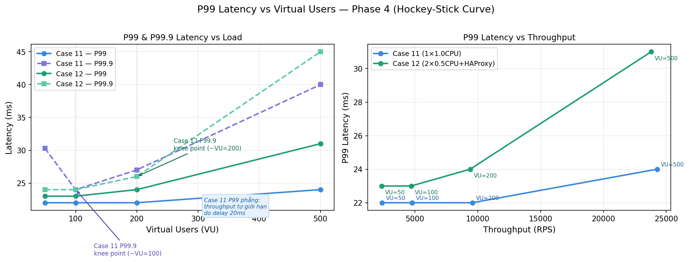

# 🚀 Container-Native Benchmarking Lab

<p align="center">
  
  
  
  
</p>

Đồ án: **Đánh giá Hiệu năng Mạng và Chi phí Ảo hóa trong Kiến trúc Container-Native: So sánh TCP Congestion Control, Docker Network Stack và Reverse Proxy dưới điều kiện mạng suy giảm và CPU Throttling.**

## 👥 Nhóm Thực Hiện (Nhóm 09)
* **Hoàng Xuân Đồng** (MSSV: 23520297) - *Server Setup & System Monitoring*
* **Trần Hải Đăng** (MSSV: 23520237) - *Client Load Generation & Network Emulation*
* **Giảng viên hướng dẫn:** Ths. Đặng Lê Bảo Chương

---

## 📖 Giới thiệu (Introduction)
Dự án này xây dựng một phòng thí nghiệm đo lường hiệu năng (Benchmarking Lab) trên môi trường Bare-metal thực tế. Mục tiêu cốt lõi là định lượng chính xác độ trễ (đặc biệt là Tail Latency - P99) và "chi phí tàng hình" (Overhead) của từng lớp trừu tượng trong hệ thống mạng hiện đại bao gồm: Docker Network, Reverse Proxy, CPU Throttling (cgroups v2), và các thuật toán TCP Congestion Control.

Dự án áp dụng chặt chẽ **Lý thuyết Hàng đợi (Queueing Theory)** và **Định luật Little ($L = \lambda \times W$)** để giải mã các hiện tượng "bùng nổ độ trễ" (Latency Explosion) và thắt cổ chai (Bottleneck) trong các hệ thống phân tán.

<p align="center"></p>

## 💻 Yêu cầu Hệ thống (Prerequisites)
Để đảm bảo tính chính xác tuyệt đối trong việc đo lường độ trễ ở mức Microsecond (µs), lab yêu cầu cấu hình khắt khe:
* **OS:** Ubuntu 24.04 LTS (Chạy trên Bare-metal, tuyệt đối không dùng máy ảo VM để tránh ảo hóa lồng ghép gây sai lệch chỉ số).
* **Kernel:** Linux Kernel 5.x trở lên (Cần thiết để hỗ trợ cgroups v2 và thuật toán TCP BBR).
* **Network:** Card mạng (NIC) Gigabit, kết nối cáp LAN chuẩn trực tiếp (Point-to-Point).

## 🛠 Công cụ & Công nghệ (Tech Stack)
* **Ảo hóa & Cân bằng tải:** Docker Engine, Nginx, HAProxy, cgroups v2.
* **Load Generation:** Apache JMeter, iperf3.
* **Network Emulation:** Linux Traffic Control (`tc` / `NetEm`).
* **Observability (Giám sát Zero Overhead):** Khai thác trực tiếp REST API của cAdvisor và các công cụ Native Linux (`dstat`, `ss`, `mpstat`, `tc qdisc`). *Lưu ý: Hệ thống chủ đích loại bỏ hoàn toàn stack Prometheus/Grafana trong quá trình đo tải thực tế nhằm triệt tiêu "Hiệu ứng quan sát" (Observer Effect).*
* **Phân tích dữ liệu & Trực quan hóa:** Python 3 (Sử dụng thư viện tiêu chuẩn để tối ưu hiệu năng parse hàng triệu dòng log, kết hợp `matplotlib` để vẽ các biểu đồ phân tích sâu).

---

## 📊 Ma Trận Thực Nghiệm (Experimental Matrix)
Dự án được triển khai qua 4 giai đoạn (Phases) với 12 kịch bản (Cases) kiểm thử nghiêm ngặt:

### Phase 1: Baseline Network Stack
Đo lường chi phí ảo hóa mạng bằng cách tạo tải 20,000 RPS tĩnh.
* **Kết quả:** Chi phí overhead của kiến trúc Docker Bridge tiêu tốn khoảng ~11.4 µs so với mạng Bare-metal. Dù có gây ra sự dịch chuyển phân phối độ trễ (Tail Latency Shift) nhưng hoàn toàn không đáng kể ở mức tải thấp. Chế độ Host mode gần như tiệm cận hiệu năng mạng gốc.
<p align="center"></p>

### Phase 2: TCP Congestion Control (CUBIC vs. BBR)
Đánh giá độ bão hòa băng thông TCP dưới điều kiện mạng lý tưởng và mạng suy giảm (Delay 50ms, Loss 2% mô phỏng qua NetEm).
* **Kết quả:** Trong LAN sạch, cả hai thuật toán đều bão hòa ở mức ~941 Mbps. Khi xuất hiện 2% packet loss, CUBIC sụp đổ hiệu năng (chỉ còn ~2.37 Mbps) do đặc tính Multiplicative Decrease. Ngược lại, Google BBR duy trì băng thông vượt trội (~341 Mbps) nhờ cơ chế đo lường độ trễ và thông lượng độc lập.
<p align="center"></p>

### Phase 3: CPU Throttling & Reverse Proxy
Sử dụng cgroups v2 để giới hạn Nginx ở mức 1.0 CPU và 0.5 CPU, sau đó phân tán tải ngang qua HAProxy.
* **Kết quả:** Tại mức tải bão hòa 40,000 RPS, Nginx nguyên khối bị CPU Throttling, khiến P99 Latency vọt lên 182ms. Giải pháp mở rộng ngang bằng HAProxy (chia cho 2 node backend x 0.5 CPU) đã khôi phục thành công hiệu năng, kéo P99 về lại mức ổn định (~77ms).
<p align="center"></p>

### Phase 4: Full Stress / Combined Stress
Kiểm thử áp lực cao kết hợp cả suy giảm mạng (Delay 20ms) và tải động (500 Virtual Users) trên kiến trúc phân tán.
* **Kết quả:** Thực chứng hiện tượng "Tự giới hạn tốc độ" (Network-induced Self-throttling) giải thích qua Định luật Little. Độ trễ mạng bắt buộc Client phải giảm tốc độ bơm tải (bị khóa ở ~23.5K RPS), giúp Server tránh khỏi sụp đổ hoàn toàn. Tại pha này, nhóm cũng đo lường được chi phí kiến trúc của Layer 7 HAProxy làm tăng độ trễ thêm khoảng ~6ms ở phân vị P99.
<p align="center"></p>
<p align="center"></p>

---

## 📂 Cấu trúc Thư mục (Directory Structure)
Dự án sử dụng `.gitignore` để loại bỏ các file raw logs (`.jtl`, `.csv`, `.log`) có kích thước khổng lồ (lên đến hàng triệu mẫu), nhằm tối ưu dung lượng kho lưu trữ.

```text
├── configs/
│   ├── haproxy/               # Cấu hình HAProxy Load Balancer
│   └── nginx/                 # Cấu hình Web Server Nginx
├── results/
│   └── processed/             # Kết quả phân tích CSV đã qua tổng hợp
├── scripts/
│   └── utils/                 # Scripts Python xử lý số liệu tự phát triển
│       ├── analyze_phase4.py
│       ├── parse_jmeter.py
│       ├── parse_phase2_final.py
│       ├── tail_analysis_nopandas.py
│       └── plot_hockey_stick.py  # Script tính toán & trực quan hóa Hockey-Stick curve
├── .gitignore
├── docker-compose.yml         # Khởi tạo kiến trúc hạ tầng mạng và container
├── README.md
└── test_plan_v3.jmx           # Kịch bản Apache JMeter (Đo tải tĩnh và động)
 ---

## ⚙️ Hướng dẫn Tái lập Lab (Reproducibility)
Để tái lập lại môi trường và chạy thử nghiệm, thực hiện các bước sau trên Node Server:
```bash
# 1. Khởi động toàn bộ kiến trúc microservices (Nginx, HAProxy)
docker compose up -d

# 2. Kích hoạt thuật toán TCP BBR ở mức Kernel
sudo sysctl -w net.ipv4.tcp_congestion_control=bbr

# 3. Tiêm nhiễu mạng (Ví dụ: Delay 50ms, Loss 2% cho kịch bản Phase 2)
sudo tc qdisc add dev enp3s0 root netem delay 50ms loss 2%

# Để gỡ bỏ rules tiêm nhiễu sau khi hoàn tất kiểm thử:
sudo tc qdisc del dev enp3s0 root
```

## ⚙️ Hướng dẫn Chạy Script Phân Tích
Các script Python được thiết kế bằng thư viện tiêu chuẩn để chạy trực tiếp không cần cài thêm dependencies (biết rằng các file py khác được up trong folder với mục đích dùng riêng ở một số case nếu người kiểm tra muốn kiểm tra kĩ hơn):

```bash
# Phân tích TCP BBR vs CUBIC (Phase 2)
python3 scripts/utils/parse_phase2_final.py

# Phân tích Tail Latency chi tiết không dùng Pandas (Phase 1 & 3)
python3 scripts/utils/tail_analysis_nopandas.py

# Phân tích Điểm bùng nổ độ trễ (Phase 4)
python3 scripts/utils/analyze_phase4.py

# Đặc biệt: Khởi tạo trực quan hóa biểu đồ Hockey-Stick Curve (Phase 4)
# Bước 1: Khởi tạo và kích hoạt môi trường ảo (venv) tại thư mục gốc
python3 -m venv .venv
source .venv/bin/activate

# Bước 2: Cài đặt thư viện vẽ biểu đồ
pip install matplotlib

# Bước 3: Chạy script xử lý hàng triệu mẫu và sinh file ảnh (.png)
python3 scripts/utils/plot_hockey_stick.py

# Tắt môi trường ảo sau khi hoàn tất
deactivate
``` 